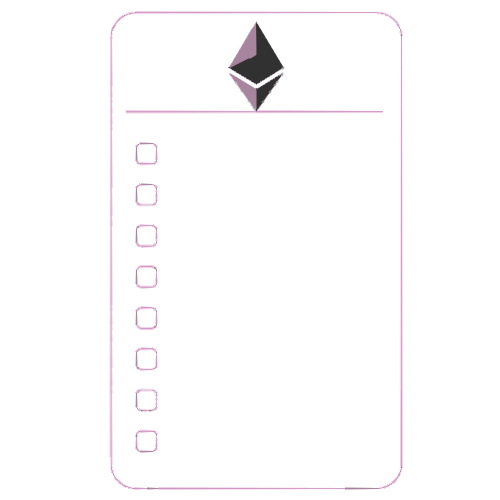
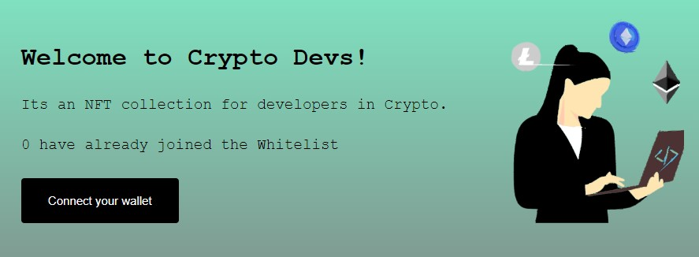

<h1 align="center"> Whitelist Dapp</h1>

A Dapp that lets the first 10 people join for free, deployed on the Rinkeby network. This project is part of the Sophomore Track at learnweb3.io.

***

***

## Prerequisites

- Have a metamask wallet setup
- Have node.js installed

### Documentation

You can see the step by step instructions at <https://learnweb3.io> (Sophomore Track) or follow along with my docs [here]( https://lesley-z.notion.site/Whitelist-Dapp-ac2287eea8e14d16820e0c624385df4d).

### Tech

       
    

***

#### License

MIT

#### Author

<a href="https://lesley-nicole.github.io">

